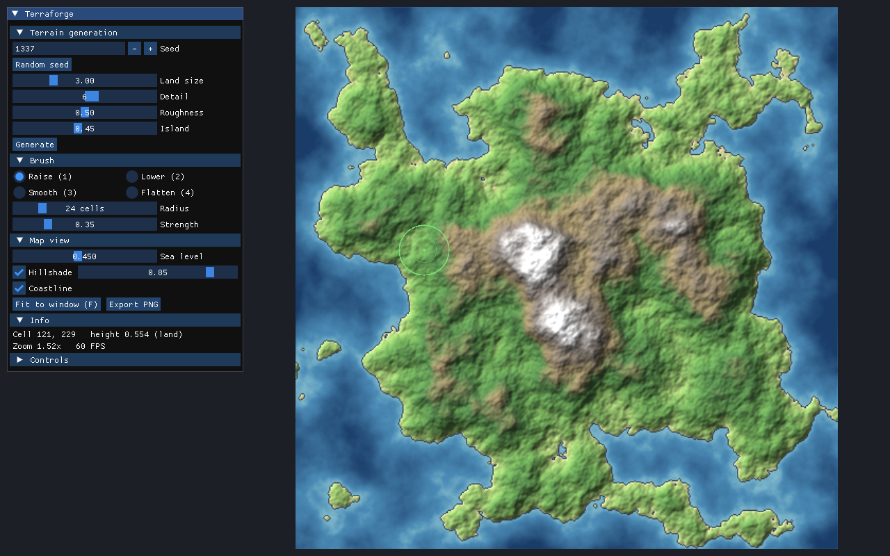

# Terraforge

Редактор карт для фэнтези-миров на C++20: генерирует континент процедурно, а потом
позволяет «лепить» рельеф кистями — поднимать горы, копать проливы, сглаживать
и выравнивать землю. Готовую карту можно сохранить в PNG.



## Возможности

- Процедурная генерация рельефа: фрактальный шум (fBm, OpenSimplex2) и маска острова,
  одинаковый seed всегда даёт одинаковую карту
- Кисти: поднять, опустить, сгладить, выровнять; мягкий край, скорость не зависит от FPS
- Уровень моря, отмывка рельефа (освещение с северо-запада, как на бумажных картах), береговая линия
- Зум к курсору, перемещение карты, экспорт в PNG
- Ядро без зависимостей от графики, покрыто юнит-тестами (GoogleTest), CI на Windows и Linux

Что будет дальше — 3D-просмотр, undo/redo, проекты в SQLite, города и подписи,
генерация лора нейросетью — в [ROADMAP.md](ROADMAP.md).

## Сборка

### Windows

Нужно один раз установить:

1. **Visual Studio 2022 или новее** (Community бесплатна) с нагрузкой
   «Разработка классических приложений на C++».
2. **CMake** и **Git**, чтобы они были доступны в терминале (после установки откройте новый терминал):
   ```powershell
   winget install Kitware.CMake
   winget install Git.Git
   ```

Сборка и запуск из терминала в папке проекта:

```powershell
cmake -S . -B build                      # первый раз скачивает библиотеки, это несколько минут
cmake --build build --config Release
ctest --test-dir build -C Release        # тесты
.\build\bin\Release\terraforge.exe
```

Или откройте папку проекта в Visual Studio («Открыть локальную папку»), выберите
`terraforge.exe` как элемент запуска и нажмите F5. Для плавной работы используйте
конфигурацию Release, Debug нужен для отладки.

### Linux

```bash
sudo apt install build-essential cmake git libx11-dev libxrandr-dev libxinerama-dev \
                 libxcursor-dev libxi-dev libgl1-mesa-dev
cmake -S . -B build -DCMAKE_BUILD_TYPE=Release
cmake --build build --parallel
ctest --test-dir build
./build/bin/terraforge
```

## Управление

| Действие | Как |
|---|---|
| Рисовать кистью | левая кнопка мыши |
| Поднять ↔ опустить | Shift + левая кнопка |
| Двигать карту | правая или средняя кнопка мыши |
| Зум | колесо мыши |
| Размер кисти | Ctrl + колесо или `[` / `]` |
| Инструменты | `1` поднять, `2` опустить, `3` сгладить, `4` выровнять |
| Вписать карту в окно | `F` |

## Устройство проекта

```
src/core/    данные и алгоритмы (без графики): Heightmap, TerrainGenerator, Brush, MapColorizer
src/app/     окно, ввод, рендер и интерфейс: App, MapRenderer, Window
tests/       юнит-тесты ядра (GoogleTest)
cmake/       подключение зависимостей и флаги предупреждений
```

Ядро не знает о raylib и ImGui, поэтому алгоритмы тестируются без окна,
а графическую часть можно заменить, не трогая логику.

## Стек

C++20 · CMake · [raylib](https://www.raylib.com) · [Dear ImGui](https://github.com/ocornut/imgui)
· [rlImGui](https://github.com/raylib-extras/rlImGui) · [FastNoiseLite](https://github.com/Auburn/FastNoiseLite)
· [GoogleTest](https://github.com/google/googletest) · GitHub Actions

Библиотеки скачиваются при сборке и распространяются под своими лицензиями
(zlib, MIT, BSD-3-Clause).
